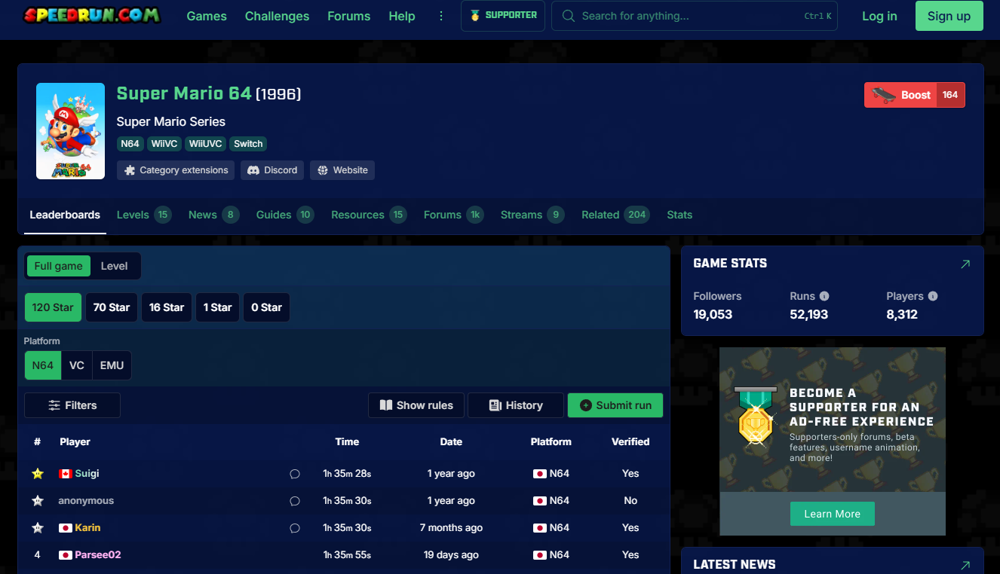
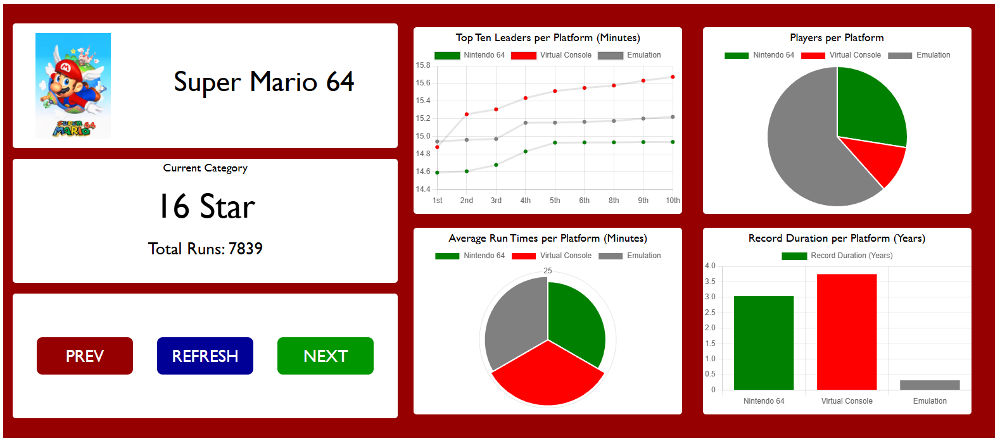

# Super Mario 64 Speedrun Data Analysis

For my final project in JavaScript, I was tasked to create a website utilizing a public charting library, and creating a data analysis dashboard using this library using four different chart types.

This project focuses on video game speedrunning data, specifically Super Mario 64, one of the most popular speedrun titles.
Speedrun.com has its own public API that can be used to retrieve data based on Game ID's, so I found what the ID was specifically for the game of choice.

The first factor to consider was the different speedrun categories.
Super Mario 64 is about collecting stars then beating the final boss of the game, the different speedrun categories are;

- 120 Stars
- 70 Stars
- 16 Stars
- 1 Star
- 0 Star

The second factor, was the different platforms players may use. For speedrun.com, there are three platforms players can play Super Mario 64;

- Nintendo 64 Original Hardware
- Virtual Console (This version was a re-release of the game for the Nintendo Wii)
- Emulator (Emulators are computer software created to essentially be a Virtual Machine of a video game console.)

The reason the console type matters and all have their own separate leaderboards, is due to the speed in which Super Mario 64 plays on each console type. 

Emulation will normally run Super Mario 64 at the fastest framerate, which will give players who use emulation an advantage over those on original hardware, as typically original hardware runs on slower framerates than emulation and Virtual Console. 

# Data Source Reference (speedrun.com)

With these factors, the questions that I wanted to answer for myself were as follows;

- How do the top 10 players compare across platforms in terms of runtimes?
- How many players are there per platform?
- What are the average run times per platform?
- How long have each platform's record withstood for?

On the website, users can navigate through the different categories, with every chart updating dynamically on the category change. 

# Final Dashboard

I have chosen to display the category data for *16 Star*, as it is the most popular category for speedrunning in Super Mario 64.

## Key Insights (16 Star Category)

- Virtual Console Top-10 times are longer, but the player count of virtual console is overwhelmed by Emulation and Nintendo 64.

- Emulation has a majority over both Nintendo 64 and Virtual Console platforms, this could be due to the easy access emulation provides as you don't need official console hardware to play the game, just a copy of the game files on your computer and the emulator itself.

- Even with Emulation having a major player advantage, Nintendo 64 still has the fastest times recorded for the category. This is due to most top professional video game speed runners like to use official hardware for practicing their runs and authenticity in the games that they play.

## Overall Outcome
The project successfully demonstrates how platform choice impacts speedrun performance and player distribution. It highlights that while emulation increases accessibility and player count, top performance is still dominated by players using original hardware.

### Tools used for website
- HTML
- CSS
- JavaScript
- API Implementation (https://github.com/speedruncomorg/api/tree/master/version1)
- chart.js Library (https://www.chartjs.org/)
- speedrun.com Data Source (https://www.speedrun.com/sm64
